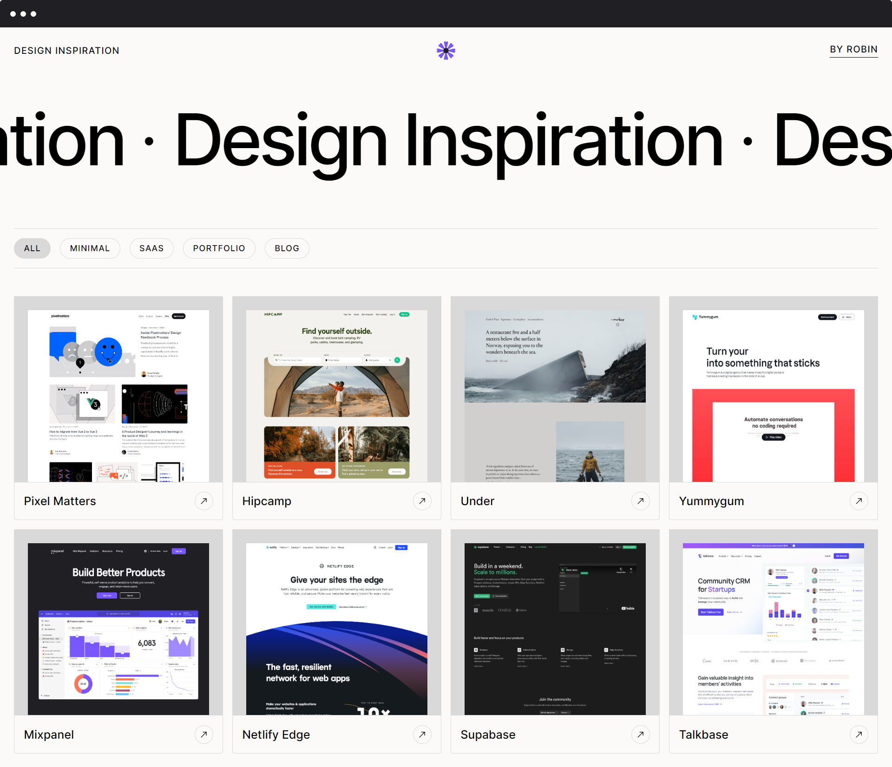

# Insp

Needed a place to store all design that I come across that inspires me, while at the same time get some CSS animation and Next.js practice.

- Built using Next.js
- Content written in markdown
- Scroll animations uing Gsap Scrolltrigger
- Smooth scrolling by Lenis (🙏)
- Pages generated as static HTML
- Deployed on ~~Cloudflare pages~~ Netlify (🙏)

bye.

[insp](https://design-inspiration.netlify.app/)

